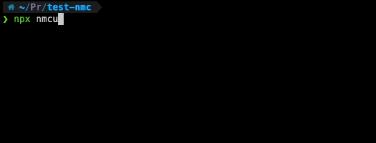

# Node Module Cleaner

If you're like me you'll probably have a lot of projects you've created to test some things, or even projects you've never finished. All those `node_modules` directories are taking up space while not being used.

This packages gives you the ability to easily clean up your `node_modules` directories in your projects by a simple command, using `npx` which we're all familiar with.

> Don't worry, running the script itself won't just start removing the directories, it'll give you a list where you need to select the projects for which you would like to remove installed dependencies.



## Cleaning up packages

Cleaning up projects in current directory

```bash
npx nmcu
```

Cleaning up projects in a given directory

```bash
npx nmcu ~/Projects
```

Cleaning up projects in multiple directories at once

```bash
npx nmcu ~/Projects ~/Sites
```
